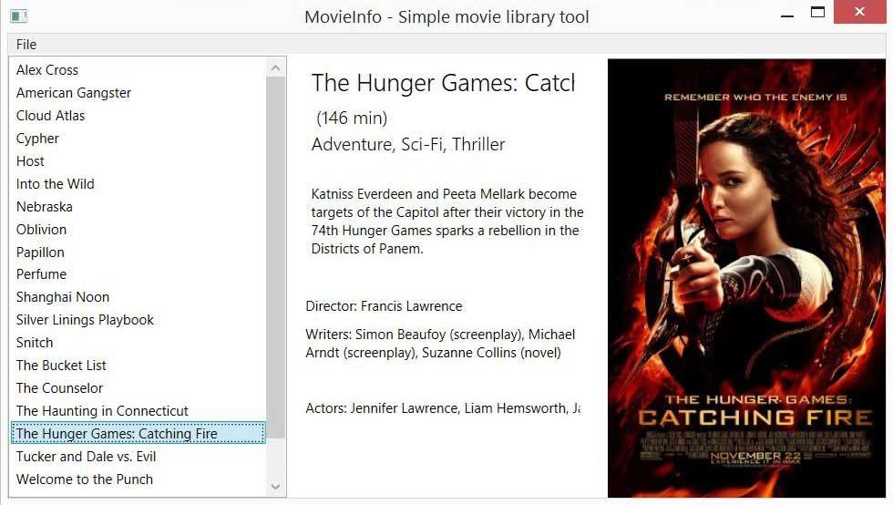

#MovieInfo - Simple movie library tool
------------------------

#Specification
MovieInfo is a simple movie library tool written in C# for retrieving movie information from
Internet Movie Database (IMDB.com) and showing it in a simple GUI. You can select folder which contains movie files and program tries to search if it can find anything about it from the Internet Movie Database.

MovieInfo uses OMDB-API ( http://www.omdbapi.com/ ) for querying IMDB.
[JSON.NET-Framework](http://www.newtonsoft.com/json) is used to serialize JSON-response to .NET-object.

System.Data.SQLite is used to save serialized objects to SQLite-Database.

#Features
- Graphical user interface
- Supported file formats (.avi, .mp4, .iso, .img)
- User can specify folder location
- Supports different file formats
- Retrieves information from IMDB
- File name parsing

#Todo
- Improve file parsing
- Improve GUI

#Docs

Author: Mikko Pakkanen
Website: http://mikkopakkanen.com
