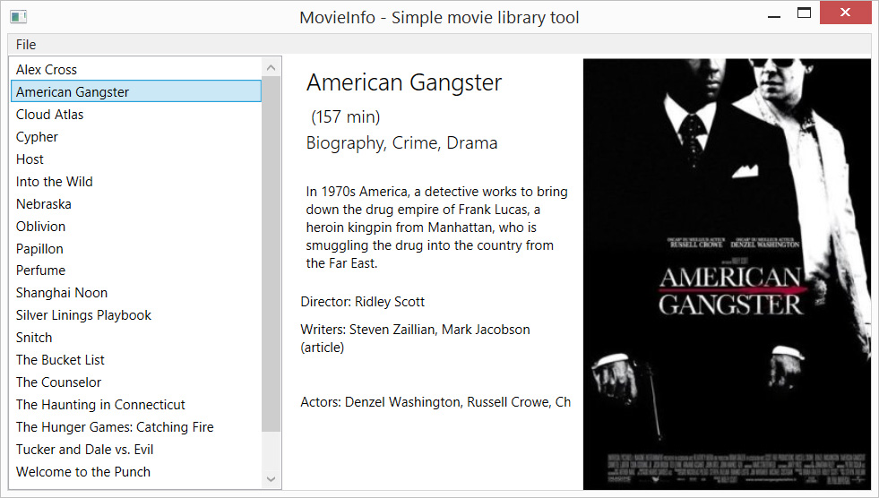

#MovieInfo - Simple movie library tool
------------------------

#Specification
MovieInfo is a simple movie library tool written in C# for retrieving movie information from
Internet Movie Database (IMDB.com) and showing it in a simple GUI. You can select folder which contains movie files and program tries to search if it can find anything about it from the Internet Movie Database.

MovieInfo uses OMDB-API ( http://www.omdbapi.com/ ) for querying IMDB.
[JSON.NET-Framework](http://www.newtonsoft.com/json) is used to serialize JSON-response to .NET-object.

System.Data.SQLite is used to save serialized objects to SQLite-Database.

#Features
* Graphical user interface
* Supported file formats (.avi, .mp4, .iso, .img)
* User can specify folder location
* Retrieves information from IMDB
  * Save information to local SQLite database
* File name parsing

#Todo
* Improve file parsing
  * Possibility to read movie metadata?
  * Make file name parsing better
* Improve GUI
  * More options for user to choose
  * More information to be displayed for the user
  * Make GUI responsible, at the moment user can't resize the window
* Add more functionality
  * Let user play the movie from GUI by pressing a button (system default mediaplayer for example)

#Docs
##Files
* [Use Case Diagram](doc/useCaseDiagram.JPG)
* [Activity Diagram](doc/activityDiagram.jpg)

##System requirements
* **Operating system:** Microsoft Windows
* **Frameworks:** .NET Framework 4.5.2 or newer
* Original project is written in Microsoft Visual Studio Community 2015, Update 1

## Installation
* Git clone files to your local repo and make a new project in Visual Studio
* test-folder contains some data to test program with
* On first startup of the program, local database *(movieInfo.sqlite)* will be generated to the same folder where program is

#Author
* Mikko Pakkanen
  * [mikkopakkanen.com](http://mikkopakkanen.com)
